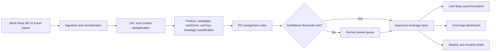

# Architecture

## Product flow

## Shared engine

Plan 1 and Plan 2 should not be separate codebases. The bridge establishes the reusable domain layer:

- Source-row parser and row reconciliation
- Canonical URL normalization and duplicate grouping
- Product taxonomy and aliases
- Campaign, sentiment, prominence, and key-message classification
- PIC routing precedence
- Confidence thresholds and exception reasons
- Review decisions and validation metrics
- Lark-ready record schema

Plan 2 moves that engine behind production ingestion, authentication, durable storage, permissions, scheduled jobs, and observability.

## PIC routing precedence

1. Campaign override
2. Exact journalist assignment
3. Journalist plus outlet assignment
4. Outlet assignment
5. Market or product fallback
6. Human review

The system never silently guesses a PIC when multiple rules conflict or no documented rule exists.

## Suggested production components

| Concern | Suggested responsibility |
| --- | --- |
| Ingestion | Scheduled Muck Rack API job or signed Excel upload |
| Processing | Idempotent worker with per-stage reconciliation counts |
| Rules | Versioned tables editable by PR operations |
| AI | Structured output with field-level evidence and confidence |
| Storage | Relational coverage, rules, review, and audit tables |
| Review | Authenticated internal web app |
| Lark | Base batch create/update plus Messenger notification cards |
| Reporting | Approved records only; links back to source evidence |
| Security | Server-side secrets, least-privilege scopes, retention policy |

## Definition of done for a pilot

- Every export row is reconciled to approved, duplicate, irrelevant, or review status.
- Product classification reaches at least 95% on the labeled validation set.
- PIC assignment reaches at least 97% where a documented rule exists.
- No low-confidence or conflicting PIC assignment is silently published.
- The weekly reviewer completes the queue within the agreed operational target.
- All corrections record reviewer, timestamp, previous value, new value, and reason.
